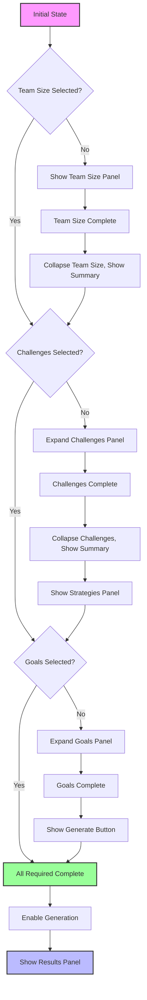

# Carmen Workshop Component Interaction Flow Diagrams

## 1. Current vs. Optimized Architecture Flow

### Current Architecture Issues
```
┌─────────────────────────────────────┐
│           CURRENT LAYOUT            │
│  ┌─────────────┐ ┌─────────────────┐ │
│  │ CONFIG      │ │ PROMPT BUILDER  │ │
│  │ PANEL       │ │                 │ │
│  │             │ │ ┌─────────────┐ │ │
│  │ Team Size   │ │ │ Segments    │ │ │
│  │ ↓ SCROLL    │ │ │             │ │ │
│  │ Challenges  │ │ │ ┌─────────┐ │ │ │
│  │ ↓ SCROLL    │ │ │ │ Results │ │ │ │
│  │ Strategies  │ │ │ │ max-h   │ │ │ │
│  │ ↓ SCROLL    │ │ │ │ ↕ CLIP  │ │ │ │
│  │ Goals       │ │ │ └─────────┘ │ │ │
│  │ ↓ SCROLL    │ │ └─────────────┘ │ │
│  │ Generate    │ │                 │ │
│  └─────────────┘ └─────────────────┘ │
└─────────────────────────────────────┘
❌ Excessive vertical scrolling
❌ Content truncation in results
❌ Poor mobile experience
```

### Optimized Architecture Flow
```
┌─────────────────────────────────────────────────────────┐
│                OPTIMIZED LAYOUT                         │
│ ┌─────────────┐ ┌─────────────┐ ┌─────────────────────┐ │
│ │ CONFIG      │ │ FLOATING    │ │ ADAPTIVE RESULTS    │ │
│ │ PANEL       │ │ PROMPT      │ │ PANEL               │ │
│ │             │ │ BUILDER     │ │                     │ │
│ │ ┌─────────┐ │ │             │ │ ┌─────────────────┐ │ │
│ │ │ Active  │ │ │ ┌─────────┐ │ │ │ Generated       │ │ │
│ │ │ Section │ │ │ │ Live    │ │ │ │ Content         │ │ │
│ │ └─────────┘ │ │ │ Update  │ │ │ │                 │ │ │
│ │ ┌─────────┐ │ │ │         │ │ │ │ ┌─────────────┐ │ │ │
│ │ │ Summary │ │ │ │ Copy    │ │ │ │ │ Expandable  │ │ │ │
│ │ │ Chips   │ │ │ │ Button  │ │ │ │ │ Sections    │ │ │ │
│ │ └─────────┘ │ │ └─────────┘ │ │ │ └─────────────┘ │ │ │
│ │             │ │             │ │ │                 │ │ │
│ │ Progressive │ │ Sticky      │ │ │ Full Height     │ │ │
│ │ Disclosure  │ │ Position    │ │ │ Utilization     │ │ │
│ └─────────────┘ └─────────────┘ └─────────────────────┘ │
└─────────────────────────────────────────────────────────┘
✅ Minimal scrolling
✅ Full content visibility  
✅ Responsive adaptation
```

## 2. Progressive Disclosure State Flow

### State Machine Diagram


### Component State Transitions
```typescript
interface WorkshopState {
  sections: {
    teamSize: SectionState;
    challenges: SectionState;
    strategies: SectionState;
    goals: SectionState;
  };
  canGenerate: boolean;
  isGenerating: boolean;
  hasResults: boolean;
}

interface SectionState {
  expanded: boolean;
  completed: boolean;
  selections: string[];
  required: boolean;
}

// State transition logic
const useProgressiveDisclosure = () => {
  const [state, setState] = useState<WorkshopState>(initialState);
  
  const updateSection = useCallback((sectionId: string, selections: string[]) => {
    setState(prev => {
      const newState = { ...prev };
      const section = newState.sections[sectionId];
      
      // Update selections
      section.selections = selections;
      section.completed = selections.length > 0;
      
      // Auto-expand next required section
      if (section.completed && section.required) {
        const nextSection = getNextRequiredSection(sectionId);
        if (nextSection && !nextSection.completed) {
          nextSection.expanded = true;
          section.expanded = false; // Collapse current
        }
      }
      
      // Update generation availability
      newState.canGenerate = areRequiredSectionsComplete(newState.sections);
      
      return newState;
    });
  }, []);
  
  return { state, updateSection };
};
```

## 3. Responsive Layout Flow

### Breakpoint Adaptation Flow
```
┌─────────────────────────────────────────────────────────┐
│                    BREAKPOINT FLOW                      │
│                                                         │
│ Mobile (320-767px)                                      │
│ ┌─────────────────┐                                     │
│ │ Header          │                                     │
│ ├─────────────────┤                                     │
│ │ Floating Prompt │ ← Always visible                    │
│ │ (Compact)       │                                     │
│ ├─────────────────┤                                     │
│ │ Active Config   │ ← One section at a time             │
│ │ Section         │                                     │
│ ├─────────────────┤                                     │
│ │ Results         │ ← Expandable modal                  │
│ │ (If Available)  │                                     │
│ └─────────────────┘                                     │
│                                                         │
│ Tablet (768-1023px)                                     │
│ ┌─────────────────────────────────────┐                 │
│ │ Header                              │                 │
│ ├─────────────────┬───────────────────┤                 │
│ │ Config Panel    │ Floating Prompt   │                 │
│ │ (2-col grid)    │ (Sticky)          │                 │
│ │                 │                   │                 │
│ │ Progressive     │ Live Updates      │                 │
│ │ Disclosure      │                   │                 │
│ ├─────────────────┴───────────────────┤                 │
│ │ Results Panel (Full Width)          │                 │
│ └─────────────────────────────────────┘                 │
│                                                         │
│ Desktop (1024px+)                                       │
│ ┌─────────────────────────────────────────────────────┐ │
│ │ Header                                              │ │
│ ├─────────────┬─────────────┬─────────────────────────┤ │
│ │ Config      │ Floating    │ Adaptive Results        │ │
│ │ Panel       │ Prompt      │ Panel                   │ │
│ │             │ Builder     │                         │ │
│ │ Progressive │ (Sticky)    │ Expandable Sections     │ │
│ │ Disclosure  │             │                         │ │
│ │             │ Live        │ Full Height             │ │
│ │ Resizable   │ Updates     │ Utilization             │ │
│ └─────────────┴─────────────┴─────────────────────────┘ │
└─────────────────────────────────────────────────────────┘
```

### Responsive Component Behavior
```typescript
const useResponsiveLayout = () => {
  const [breakpoint, setBreakpoint] = useState<Breakpoint>('desktop');
  const [layoutConfig, setLayoutConfig] = useState<LayoutConfig>();
  
  useEffect(() => {
    const updateLayout = () => {
      const width = window.innerWidth;
      let newBreakpoint: Breakpoint;
      let newConfig: LayoutConfig;
      
      if (width < 768) {
        newBreakpoint = 'mobile';
        newConfig = {
          layout: 'stacked',
          promptPosition: 'fixed-top',
          configExpansion: 'single-section',
          resultsDisplay: 'modal'
        };
      } else if (width < 1024) {
        newBreakpoint = 'tablet';
        newConfig = {
          layout: 'two-column',
          promptPosition: 'sticky-side',
          configExpansion: 'progressive',
          resultsDisplay: 'bottom-panel'
        };
      } else {
        newBreakpoint = 'desktop';
        newConfig = {
          layout: 'three-column',
          promptPosition: 'center-sticky',
          configExpansion: 'progressive',
          resultsDisplay: 'side-panel'
        };
      }
      
      setBreakpoint(newBreakpoint);
      setLayoutConfig(newConfig);
    };
    
    updateLayout();
    window.addEventListener('resize', updateLayout);
    return () => window.removeEventListener('resize', updateLayout);
  }, []);
  
  return { breakpoint, layoutConfig };
};
```

## 4. Data Flow Architecture

### Unidirectional Data Flow
```
┌─────────────────────────────────────────────────────────┐
│                     DATA FLOW                           │
│                                                         │
│ User Input                                              │
│     ↓                                                   │
│ ┌─────────────────┐                                     │
│ │ OptionSelection │                                     │
│ │ Component       │                                     │
│ └─────────────────┘                                     │
│     ↓                                                   │
│ ┌─────────────────┐                                     │
│ │ State Update    │                                     │
│ │ (useWorkshop)   │                                     │
│ └─────────────────┘                                     │
│     ↓                                                   │
│ ┌─────────────────┐     ┌─────────────────┐             │
│ │ Prompt Builder  │ ←→  │ Results Panel   │             │
│ │ Live Update     │     │ Auto Refresh    │             │
│ └─────────────────┘     └─────────────────┘             │
│     ↓                         ↓                         │
│ ┌─────────────────┐     ┌─────────────────┐             │
│ │ AI Generation   │     │ UI State        │             │
│ │ Request         │     │ Management      │             │
│ └─────────────────┘     └─────────────────┘             │
│     ↓                                                   │
│ ┌─────────────────┐                                     │
│ │ Generated       │                                     │
│ │ Content         │                                     │
│ └─────────────────┘                                     │
└─────────────────────────────────────────────────────────┘
```

### State Management Hook
```typescript
const useWorkshopState = () => {
  const [selections, setSelections] = useState<WorkshopSelections>({});
  const [promptSegments, setPromptSegments] = useState<PromptSegment[]>([]);
  const [generatedContent, setGeneratedContent] = useState<string>('');
  const [uiState, setUiState] = useState<UIState>({});
  
  // Derived state
  const canGenerate = useMemo(() => 
    validateRequiredSelections(selections), [selections]);
  
  const progressPercentage = useMemo(() => 
    calculateProgress(selections), [selections]);
  
  // Effects for auto-updates
  useEffect(() => {
    updatePromptSegments(selections);
  }, [selections]);
  
  useEffect(() => {
    updateProgressiveDisclosure(selections);
  }, [selections]);
  
  return {
    selections,
    setSelections,
    promptSegments,
    generatedContent,
    setGeneratedContent,
    uiState,
    setUiState,
    canGenerate,
    progressPercentage
  };
};
```

## 5. Touch Interaction Flow (Mobile)

### Mobile Gesture Flow
```
┌─────────────────────────────────────────────────────────┐
│                 MOBILE INTERACTION FLOW                 │
│                                                         │
│ Touch Input                                             │
│     ↓                                                   │
│ ┌─────────────────┐                                     │
│ │ Gesture         │                                     │
│ │ Recognition     │                                     │
│ └─────────────────┘                                     │
│     ↓                                                   │
│ ┌─────────────────┐     ┌─────────────────┐             │
│ │ Tap: Select     │     │ Swipe: Navigate │             │
│ │ Option          │     │ Between Panels  │             │
│ └─────────────────┘     └─────────────────┘             │
│     ↓                         ↓                         │
│ ┌─────────────────┐     ┌─────────────────┐             │
│ │ Visual          │     │ Panel           │             │
│ │ Feedback        │     │ Transition      │             │
│ └─────────────────┘     └─────────────────┘             │
│     ↓                         ↓                         │
│ ┌─────────────────┐     ┌─────────────────┐             │
│ │ State Update    │     │ Focus           │             │
│ │ + Haptic        │     │ Management      │             │
│ └─────────────────┘     └─────────────────┘             │
│     ↓                                                   │
│ ┌─────────────────┐                                     │
│ │ Auto Progress   │                                     │
│ │ to Next Step    │                                     │
│ └─────────────────┘                                     │
└─────────────────────────────────────────────────────────┘
```

### Touch Event Handlers
```typescript
const useMobileInteractions = () => {
  const [touchStart, setTouchStart] = useState<TouchPoint | null>(null);
  const [isSwipping, setIsSwipping] = useState(false);
  
  const handleTouchStart = useCallback((e: TouchEvent) => {
    setTouchStart({
      x: e.touches[0].clientX,
      y: e.touches[0].clientY,
      timestamp: Date.now()
    });
  }, []);
  
  const handleTouchEnd = useCallback((e: TouchEvent) => {
    if (!touchStart) return;
    
    const touchEnd = {
      x: e.changedTouches[0].clientX,
      y: e.changedTouches[0].clientY,
      timestamp: Date.now()
    };
    
    const deltaX = touchEnd.x - touchStart.x;
    const deltaY = touchEnd.y - touchStart.y;
    const deltaTime = touchEnd.timestamp - touchStart.timestamp;
    
    // Detect swipe gestures
    if (Math.abs(deltaX) > 50 && deltaTime < 300) {
      if (deltaX > 0) {
        onSwipeRight();
      } else {
        onSwipeLeft();
      }
    }
    
    setTouchStart(null);
    setIsSwipping(false);
  }, [touchStart]);
  
  return {
    handleTouchStart,
    handleTouchEnd,
    isSwipping
  };
};
```

## 6. Performance Optimization Flow

### Rendering Optimization Pipeline
```
┌─────────────────────────────────────────────────────────┐
│              PERFORMANCE OPTIMIZATION                   │
│                                                         │
│ Component Mount                                         │
│     ↓                                                   │
│ ┌─────────────────┐                                     │
│ │ Lazy Loading    │ ← Load components as needed         │
│ │ Assessment      │                                     │
│ └─────────────────┘                                     │
│     ↓                                                   │
│ ┌─────────────────┐                                     │
│ │ Virtual         │ ← Only render visible items         │
│ │ Scrolling       │                                     │
│ └─────────────────┘                                     │
│     ↓                                                   │
│ ┌─────────────────┐                                     │
│ │ Memoization     │ ← React.memo for stable components  │
│ │ Strategy        │                                     │
│ └─────────────────┘                                     │
│     ↓                                                   │
│ ┌─────────────────┐     ┌─────────────────┐             │
│ │ Animation       │     │ State           │             │
│ │ Optimization    │     │ Batching        │             │
│ └─────────────────┘     └─────────────────┘             │
│     ↓                         ↓                         │
│ ┌─────────────────┐     ┌─────────────────┐             │
│ │ Bundle          │     │ Image           │             │
│ │ Splitting       │     │ Optimization    │             │
│ └─────────────────┘     └─────────────────┘             │
└─────────────────────────────────────────────────────────┘
```

This comprehensive flow diagram system provides a clear roadmap for implementing the optimized Carmen workshop interface, ensuring smooth user interactions and efficient resource utilization across all device types.