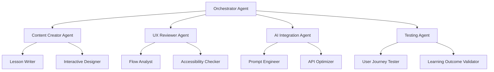

# AI Learning Hub - Codebase Review & Scaling Guidelines

## Executive Summary

The AI Learning Hub is a well-architected educational platform designed to empower non-profits with AI tools. The system uses a **database-driven content model** with no chapter-specific React components, enabling rapid content scaling. The platform demonstrates strong foundations in user engagement through AI interactions, progressive learning, and thoughtful UX design.

## 🎯 Platform Mission & User Journey

**Target Audience**: Non-profit organizations and workers with low-to-average AI knowledge
**Goal**: Transform AI novices into confident practitioners who can leverage AI tools for greater impact
**Learning Path**: Theory → Guided Practice → Independent Application → Real-World Projects

## 🏗️ Architecture Review

### Strengths

1. **Database-Driven Content Architecture**
   - All content stored in Supabase, no hardcoded chapter components
   - Enables content creation without code changes
   - Consistent experience across all chapters

2. **Engagement-First Design**
   - Content blocking pattern drives active participation
   - Minimum 3 AI chat exchanges to unlock content
   - Natural progression from passive reading to active learning

3. **Comprehensive Progress Tracking**
   - Granular tracking at content block level
   - Real-time progress updates
   - Chapter completion logic built-in

4. **AI Integration Infrastructure**
   - Lyra AI mentor with contextual awareness
   - Multiple AI-powered interactive elements
   - Streaming responses for natural interaction

### Areas for Enhancement

1. **Content Creation Workflow**
   - No automated content validation
   - Manual database inserts required
   - Limited preview capabilities

2. **AI Cost Optimization**
   - No usage tracking for OpenAI API calls
   - Potential for conversation context bloat
   - No rate limiting implementation

3. **Learning Analytics**
   - Basic progress tracking only
   - No learning effectiveness metrics
   - Limited insight into user struggles

4. **Content Versioning**
   - No revision history for content
   - Difficult to A/B test content variations
   - No rollback capabilities

## 📐 Enhanced Chapter Creation Framework

### Chapter Structure Formula

Each chapter follows a **progressive complexity model**:

```
Chapter N = {
  Theory: 40% - (N-1) × 5%
  Guided Practice: 30% + (N-1) × 5%
  Applied Learning: 20% + (N-1) × 5%
  AI Interactions: 10% + (N-1) × 5%
}
```

### Content Progression Map

#### Chapter 1: AI Fundamentals (Current)
- **Theory**: 40% - Understanding AI basics
- **Practice**: 30% - Simple prompting exercises
- **Applied**: 20% - Basic AI chat interactions
- **AI Work**: 10% - Lyra mentoring

#### Chapter 2: AI in Fundraising
- **Theory**: 35% - Fundraising strategies with AI
- **Practice**: 35% - Grant writing exercises
- **Applied**: 25% - Donor persona creation
- **AI Work**: 15% - Multiple AI tools

#### Chapter 3: Content Creation & Marketing
- **Theory**: 30% - AI content strategies
- **Practice**: 40% - Social media, email campaigns
- **Applied**: 30% - Campaign creation
- **AI Work**: 20% - Content generation tools

#### Chapter 4: Data Analysis & Insights
- **Theory**: 25% - Understanding AI analytics
- **Practice**: 45% - Data interpretation
- **Applied**: 35% - Impact measurement
- **AI Work**: 25% - Analysis tools

#### Chapter 5: Workflow Automation
- **Theory**: 20% - Automation concepts
- **Practice**: 50% - Building workflows
- **Applied**: 40% - Custom automations
- **AI Work**: 30% - Integration practice

#### Chapter 6: Capstone Project
- **Theory**: 15% - Project planning
- **Practice**: 55% - Full implementation
- **Applied**: 45% - Real-world application
- **AI Work**: 35% - Complete AI toolkit

### Interactive Element Progression

```javascript
// Chapter 1-2: Foundation
- lyra_chat (contextual mentoring)
- knowledge_check (understanding validation)
- reflection (personal connection)

// Chapter 3-4: Application
- ai_content_generator
- donor_persona_generator
- grant_writing_assistant
- data_analysis_tool (new)

// Chapter 5-6: Integration
- workflow_builder (new)
- ai_toolkit_sandbox (new)
- project_showcase (new)
```

## 🎨 UX/UI Design Guidelines

### Visual Language

1. **Color Psychology**
   - Primary gradient: Hope & Innovation (current purple-blue)
   - Success states: Growth green (#10b981)
   - AI interactions: Trustworthy blue (#3b82f6)
   - Warnings: Gentle amber (#f59e0b)

2. **Typography Hierarchy**
   - Headers: Clear, confident (current system works well)
   - Body: Comfortable reading (16px minimum)
   - AI responses: Slightly distinct (italic or different weight)

3. **Micro-interactions**
   - Content unlock: Smooth fade-in (current)
   - Progress updates: Subtle pulse animation
   - AI thinking: Gentle breathing dot animation
   - Success moments: Confetti or star burst

### Content Presentation Patterns

```typescript
// Enhanced content block types
interface ContentBlock {
  // Existing types
  text: TextContent;
  image: ImageContent;
  callout_box: CalloutContent;
  
  // New engaging types
  comparison_table: ComparisonContent;
  before_after: TransformationContent;
  mini_case_study: CaseStudyContent;
  tip_carousel: TipContent;
  progress_checkpoint: CheckpointContent;
}
```

### AI Interaction Patterns

1. **Conversational Scaffolding**
   ```
   Lesson Start → Warm greeting → Context setting → First prompt
   During Chat → Encouragement → Gentle corrections → Celebrations
   Lesson End → Summary → Next steps → Confidence boost
   ```

2. **Prompt Templates by Chapter**
   - Chapter 1-2: Fill-in-the-blank prompts
   - Chapter 3-4: Scenario-based prompts
   - Chapter 5-6: Open-ended project prompts

3. **Error Handling with Empathy**
   - "Let's try a different approach..."
   - "That's a great start! Consider also..."
   - "You're on the right track. What if we..."

## 🤖 Agent-Based Development System

### Multi-Agent Architecture



### Agent Responsibilities

1. **Orchestrator Agent**
   - Manages chapter creation workflow
   - Coordinates between agents
   - Ensures consistency across chapters
   - Tracks progress and iterations

2. **Content Creator Agent**
   - Writes lesson content following guidelines
   - Creates interactive element configurations
   - Ensures progressive complexity
   - Maintains non-profit focus

3. **UX Reviewer Agent**
   - Reviews content flow
   - Validates engagement patterns
   - Ensures mobile responsiveness
   - Checks cognitive load

4. **AI Integration Agent**
   - Designs AI interactions
   - Optimizes prompts for learning
   - Manages API efficiency
   - Creates contextual responses

5. **Testing Agent**
   - Simulates user journeys
   - Validates learning outcomes
   - Tests edge cases
   - Measures engagement

### Iterative Development Workflow

```bash
# Phase 1: Initial Creation
./claude-flow sparc run orchestrator "Create Chapter 2 framework"
./claude-flow sparc run content-creator "Write Chapter 2 lessons"
./claude-flow memory store "chapter_2_v1" "Initial chapter content"

# Phase 2: Review & Enhance
./claude-flow sparc run ux-reviewer "Review Chapter 2 flow"
./claude-flow sparc run ai-integration "Optimize Chapter 2 AI interactions"
./claude-flow memory store "chapter_2_v2" "Enhanced with UX/AI feedback"

# Phase 3: Test & Iterate
./claude-flow sparc run tester "Test Chapter 2 user journey"
./claude-flow memory get "test_results"
./claude-flow sparc run orchestrator "Iterate based on test results"

# Phase 4: Final Polish
./claude-flow swarm "Polish Chapter 2" --strategy optimization --mode hierarchical
./claude-flow memory store "chapter_2_final" "Production-ready chapter"
```

## 📋 Chapter Creation Checklist

### Pre-Creation
- [ ] Review previous chapter learning outcomes
- [ ] Define chapter learning objectives
- [ ] Map AI tool integrations needed
- [ ] Create content outline with timing
- [ ] Design interactive element placement

### Content Creation
- [ ] Write engaging lesson introductions
- [ ] Create 150-300 word content blocks
- [ ] Design 3-5 interactive elements per lesson
- [ ] Write Lyra AI conversation starters
- [ ] Create knowledge check questions

### AI Integration
- [ ] Configure AI tool demonstrations
- [ ] Write contextual prompts for Lyra
- [ ] Set up hands-on practice scenarios
- [ ] Create fallback responses
- [ ] Test API call efficiency

### Quality Assurance
- [ ] Test complete user journey
- [ ] Validate 15-25 minute lesson duration
- [ ] Check mobile responsiveness
- [ ] Ensure accessibility compliance
- [ ] Verify learning outcome achievement

### Post-Launch
- [ ] Monitor user engagement metrics
- [ ] Collect user feedback
- [ ] Track AI usage costs
- [ ] Identify improvement areas
- [ ] Plan iterative enhancements

## 🚀 Implementation Roadmap

### Phase 1: Foundation Enhancement (Week 1)
1. Create agent system infrastructure
2. Develop content validation tools
3. Build preview environment
4. Implement usage tracking

### Phase 2: Chapter 2 Development (Week 2)
1. Use agent system to create Chapter 2
2. Focus on fundraising AI tools
3. Implement grant writing assistant
4. Add donor persona generator

### Phase 3: Chapters 3-4 (Weeks 3-4)
1. Content creation & marketing focus
2. Data analysis & insights
3. Progressive complexity increase
4. More hands-on AI work

### Phase 4: Chapters 5-6 (Weeks 5-6)
1. Workflow automation
2. Capstone project framework
3. Real-world application
4. Portfolio showcase

### Phase 5: Optimization (Week 7)
1. Performance optimization
2. Cost analysis & optimization
3. User feedback integration
4. Launch preparation

## 🎯 Success Metrics

### Engagement Metrics
- Average session duration > 20 minutes
- Lesson completion rate > 80%
- AI interaction rate > 90%
- Chapter progression rate > 70%

### Learning Metrics
- Knowledge check pass rate > 85%
- Practical application completion > 75%
- Confidence score increase > 40%
- Real-world implementation > 60%

### Platform Metrics
- Page load time < 2 seconds
- AI response time < 3 seconds
- Error rate < 0.5%
- User satisfaction > 4.5/5

## 📝 Final Recommendations

1. **Maintain Content Excellence**
   - Keep non-profit focus central
   - Use real-world examples
   - Celebrate small wins
   - Build confidence gradually

2. **Optimize AI Interactions**
   - Cache common responses
   - Implement usage limits
   - Create fallback content
   - Monitor costs closely

3. **Scale Thoughtfully**
   - Use agent system for consistency
   - Test with real users
   - Iterate based on feedback
   - Document all decisions

4. **Measure Impact**
   - Track learning outcomes
   - Collect success stories
   - Build case studies
   - Share impact metrics

This framework provides a solid foundation for scaling the AI Learning Hub while maintaining quality, engagement, and learning effectiveness. The agent-based development system ensures consistent, iterative improvement across all chapters.