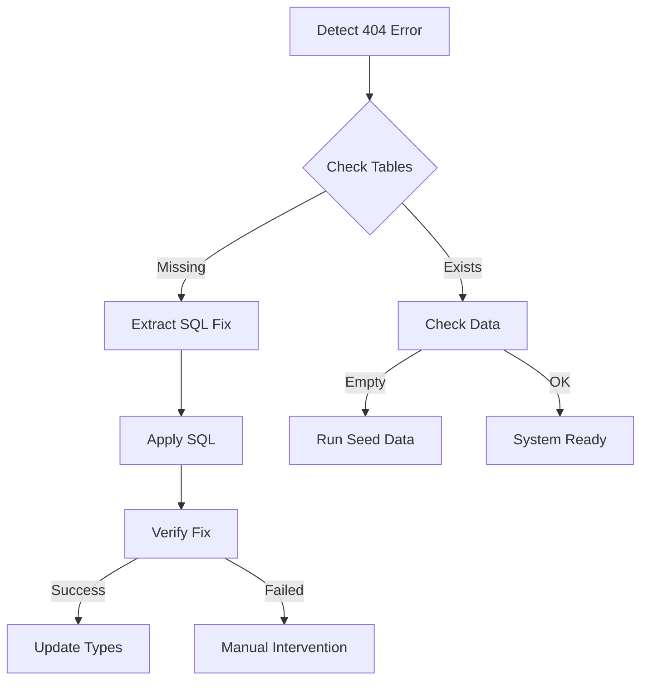

# 🤖 Automated Database Fix System

## Overview

This automated system handles database schema issues, particularly the missing toolkit tables error. It provides multiple levels of automation from detection to resolution.

## Components

### 1. **Automated Detection & Fix Script**
- **File**: `scripts/automated-db-fix.js`
- **Purpose**: Automatically detects missing tables and applies fixes
- **Features**:
  - Checks for missing tables
  - Extracts SQL from documentation
  - Creates automated workflows
  - Integrates with MCP tools

### 2. **Verification Script**
- **File**: `scripts/verify-toolkit-fix.js`
- **Purpose**: Validates database state
- **Usage**: `node scripts/verify-toolkit-fix.js`

### 3. **MCP Workflow Integration**
- **File**: `.claude/workflows/db-fix-automation.json`
- **Purpose**: Automated workflow for Claude Flow
- **Triggers**: 404 errors on toolkit tables

## Usage

### Method 1: Direct Automation (Requires DATABASE_URL)

```bash
# Set your database URL (get from Supabase dashboard)
export DATABASE_URL="postgresql://postgres:[password]@[host]:[port]/postgres"

# Run the automated fix
./scripts/apply-db-fix.sh
```

### Method 2: Semi-Automated with Supabase CLI

```bash
# 1. Generate the SQL fix file
node scripts/automated-db-fix.js

# 2. Apply using Supabase CLI
supabase db push --file scripts/toolkit-fix.sql

# 3. Verify the fix
node scripts/verify-toolkit-fix.js
```

### Method 3: MCP Tool Automation

When using Claude Flow MCP tools:

```javascript
// The workflow automatically triggers on toolkit errors
mcp__claude-flow__workflow_execute({ 
  workflowId: "db-fix-automation" 
})
```

### Method 4: Manual Fallback

If automation fails:
1. Open Supabase SQL Editor
2. Copy SQL from `APPLY_TOOLKIT_FIX.md`
3. Execute the SQL
4. Run verification script

## Automation Workflow



## Environment Setup

### Required Environment Variables

```bash
# For Supabase client
VITE_SUPABASE_URL=https://your-project.supabase.co
VITE_SUPABASE_ANON_KEY=your-anon-key

# For automated fixes (optional but recommended)
SUPABASE_SERVICE_ROLE_KEY=your-service-role-key
DATABASE_URL=postgresql://...
```

### Setting up Service Role Key

1. Go to Supabase Dashboard > Settings > API
2. Copy the `service_role` key (keep it secret!)
3. Add to `.env` file:
   ```
   SUPABASE_SERVICE_ROLE_KEY=eyJ...
   ```

## Scheduled Automation

### Using GitHub Actions

Create `.github/workflows/db-health-check.yml`:

```yaml
name: Database Health Check

on:
  schedule:
    - cron: '0 */6 * * *'  # Every 6 hours
  workflow_dispatch:

jobs:
  check-db:
    runs-on: ubuntu-latest
    steps:
      - uses: actions/checkout@v3
      - uses: actions/setup-node@v3
        with:
          node-version: '18'
      
      - name: Install dependencies
        run: npm ci
      
      - name: Check database health
        env:
          VITE_SUPABASE_URL: ${{ secrets.SUPABASE_URL }}
          VITE_SUPABASE_ANON_KEY: ${{ secrets.SUPABASE_ANON_KEY }}
        run: |
          node scripts/verify-toolkit-fix.js || node scripts/automated-db-fix.js
```

### Using Cron Job

```bash
# Add to crontab
0 */6 * * * cd /path/to/project && node scripts/verify-toolkit-fix.js || ./scripts/apply-db-fix.sh
```

## Troubleshooting

### Common Issues

1. **"SUPABASE_SERVICE_ROLE_KEY not found"**
   - Add the service role key to your `.env` file
   - Or use manual method via SQL Editor

2. **"DATABASE_URL not set"**
   - Get connection string from Supabase Dashboard > Settings > Database
   - Format: `postgresql://postgres:[password]@[host]:[port]/postgres`

3. **"RPC function not available"**
   - This is expected - use alternative methods
   - Consider creating custom RPC function for automation

4. **Verification still fails after fix**
   - Check RLS policies are properly set
   - Ensure you're connected to correct project
   - Try refreshing Supabase connection

### Debug Mode

Run with debug output:
```bash
DEBUG=* node scripts/automated-db-fix.js
```

## Integration with Development Workflow

### Pre-commit Hook

Add to `.husky/pre-commit`:
```bash
#!/bin/sh
. "$(dirname "$0")/_/husky.sh"

# Check database health before commit
node scripts/verify-toolkit-fix.js || {
  echo "⚠️  Database issues detected. Run: npm run db:fix"
  exit 1
}
```

### NPM Scripts

Add to `package.json`:
```json
{
  "scripts": {
    "db:check": "node scripts/verify-toolkit-fix.js",
    "db:fix": "node scripts/automated-db-fix.js",
    "db:fix:apply": "./scripts/apply-db-fix.sh",
    "db:seed": "psql $DATABASE_URL < supabase/seeds/toolkit-data.sql"
  }
}
```

## MCP Tool Integration

The system integrates with Claude Flow MCP tools:

1. **Automatic Trigger**: Detects toolkit-related errors
2. **Memory Storage**: Saves fix results for analysis
3. **Workflow Execution**: Can be triggered via MCP tools
4. **Performance Tracking**: Monitors fix application time

### Using with Swarms

```javascript
// Initialize swarm for database maintenance
mcp__claude-flow__swarm_init({ 
  topology: "hierarchical", 
  maxAgents: 3 
})

// Spawn specialized agents
mcp__claude-flow__agent_spawn({ 
  type: "analyst", 
  name: "DB Health Monitor" 
})

// Orchestrate fix
mcp__claude-flow__task_orchestrate({ 
  task: "Monitor and fix database issues",
  strategy: "adaptive"
})
```

## Monitoring & Alerts

### Health Check Endpoint

Create `api/db-health`:
```javascript
export default async function handler(req, res) {
  const result = await checkDatabaseHealth();
  
  if (result.healthy) {
    res.status(200).json({ status: 'healthy', ...result });
  } else {
    res.status(503).json({ status: 'unhealthy', ...result });
    // Trigger automated fix
    await triggerAutomatedFix();
  }
}
```

### Monitoring Services

Configure monitoring tools:
- **Uptime Robot**: Monitor `/api/db-health`
- **Datadog**: Track database performance
- **Sentry**: Capture toolkit-related errors

## Best Practices

1. **Regular Checks**: Run verification daily
2. **Backup First**: Always backup before major fixes
3. **Test Locally**: Test fixes in development first
4. **Monitor Logs**: Check Supabase logs after fixes
5. **Document Changes**: Log all automated fixes

## Security Considerations

1. **Service Role Key**: Never commit to version control
2. **Database URL**: Use environment variables only
3. **RLS Policies**: Verify after each fix
4. **Audit Trail**: Log all automated operations

## Future Enhancements

1. **Self-Healing**: Automatic fix on error detection
2. **Rollback**: Automated rollback on failure
3. **Multi-DB**: Support for multiple environments
4. **AI Analysis**: Use AI to predict issues
5. **Visual Dashboard**: Real-time health monitoring

---

## Quick Reference

```bash
# Check database health
npm run db:check

# Apply automated fix
npm run db:fix

# Manual SQL execution
psql $DATABASE_URL < scripts/toolkit-fix.sql

# Verify after fix
node scripts/verify-toolkit-fix.js

# Full automated workflow
./scripts/apply-db-fix.sh
```

For issues, check the logs in `scripts/logs/` or run with `DEBUG=*`.